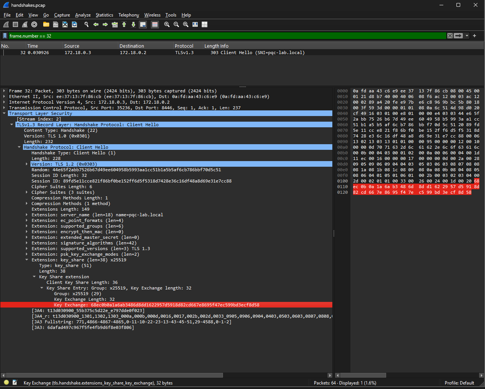
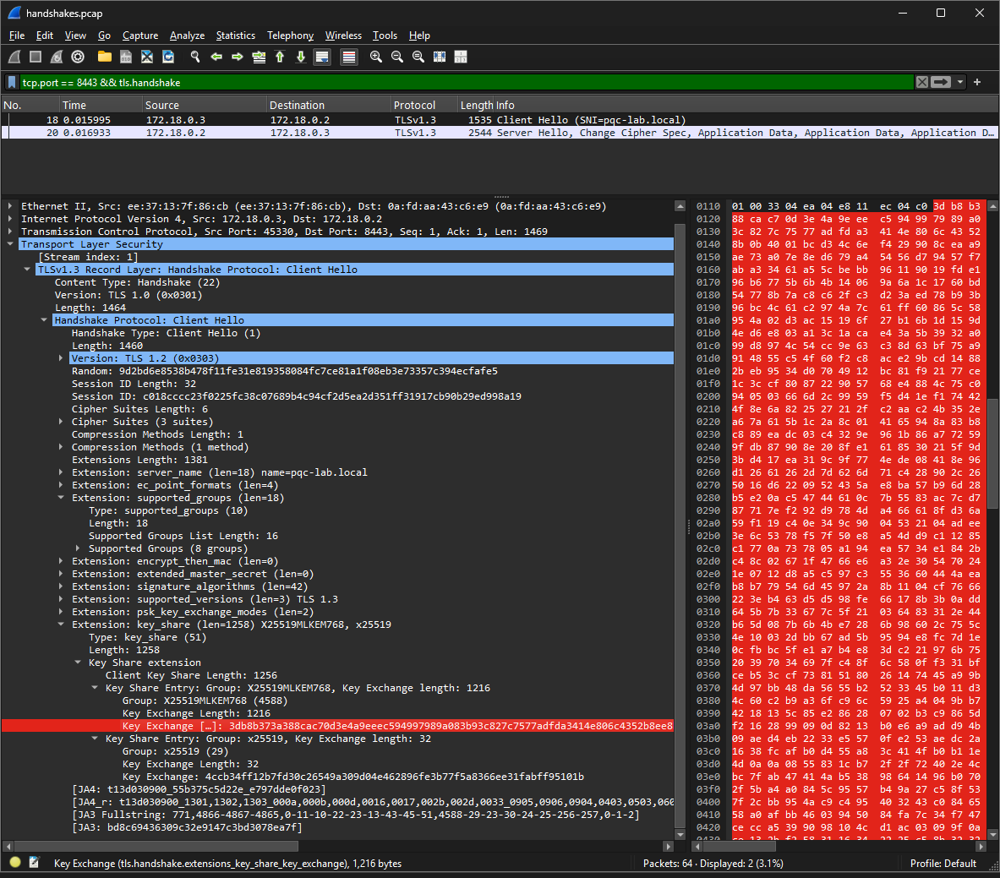
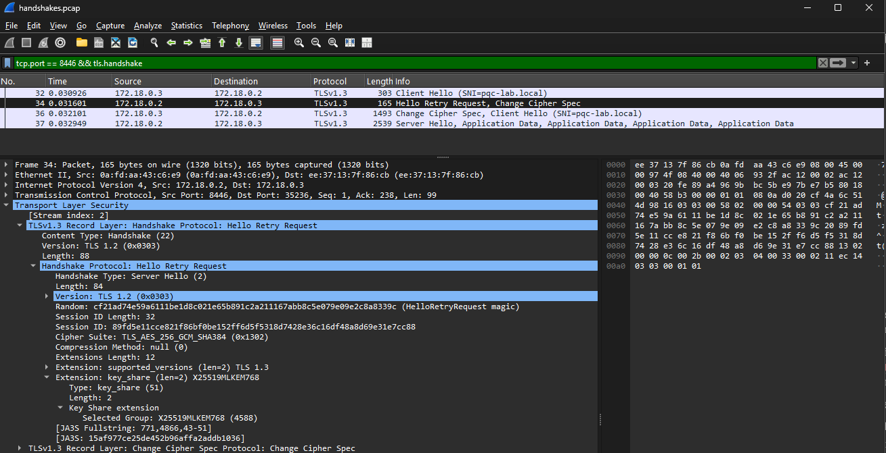

# PQC TLS Lab: hybrid ML-KEM TLS 1.3, measured

A reproducible Docker lab that serves TLS 1.3 four ways (classical, hybrid post-quantum, strictly enforced hybrid, and pure post-quantum). It then measures what each costs in bytes, round trips and latency, and which clients break.

It uses **OpenSSL 3.5 (LTS)**, which includes ML-KEM (FIPS 203), ML-DSA (FIPS 204) and the hybrid TLS group `X25519MLKEM768`. You don't need oqs-provider or a patched fork. nginx 1.28 is built against it. Both are compiled from pinned, checksum-verified source, so results don't depend on which OpenSSL your distro ships.

```
                      ┌────────────────────── pqc-server (nginx 1.28 + OpenSSL 3.5.4) ─────────────────────┐
 pqc-client           │ :8444  classical      X25519, P-256                          ECDSA P-256 cert      │
 (hsbench, sigbench,  │ :8443  hybrid         X25519MLKEM768 → X25519 → P-256        ECDSA P-256 cert      │
  openssl 3.5 CLI) ──▶│ :8446  hybrid-strict  X25519MLKEM768 / X25519:P-256 (HRR)    ECDSA P-256 cert      │
                      │ :8445  pq-only        ML-KEM-1024                            ML-DSA-65 cert chain  │
                      └────────────────────────────────────────────────────────────────────────────────────┘
```

## Quick start

Requires Docker (Docker Desktop on macOS works; Apple Silicon builds natively as arm64).

```bash
make up          # build image (~4–10 min first time, compiles OpenSSL + nginx), start both containers
make smoke       # one HTTPS request per endpoint; the response echoes the negotiated group
make bench       # 8 handshake scenarios × 200 handshakes + ML-KEM/ML-DSA primitive benchmarks
make bench-wan   # same scenarios with +25 ms per round trip (tc netem) so round trips show up
make capture     # results/handshakes.pcap: open in Wireshark and inspect the key_share
make logs        # server-side proof: nginx logs group=X25519MLKEM768 per request
make clean       # stop and delete generated certs
```

Results land in `results/` (`handshakes.csv`, `handshakes.md`, `primitives.txt`).

## Results

Sample run: Windows 11 Pro laptop (WSL2 + Docker Desktop, x86_64), loopback between the two containers, 200 handshakes per scenario. Full output is in [`docs/sample-results.md`](docs/sample-results.md). **Byte counts are reproducible (to within 1–2 bytes of ECDSA signature encoding); timings are not**, so re-run on your own hardware before quoting them.

| # | Scenario | Result | Group negotiated | HRR | ClientHello | Server→client total | Median |
|---|---|---|---|---|---:|---:|---:|
| 1 | Classical client → classical server | ✅ | x25519 | no | 232 B | 1,389 B | 2.38 ms |
| 2 | OpenSSL 3.5 default client → hybrid | ✅ | **X25519MLKEM768** | no | 1,464 B | 2,478 B | 2.80 ms |
| 3 | Client leading with X25519 share → hybrid | ⚠️ | **x25519** (silently classical) | no | 232 B | 1,403 B | 2.22 ms |
| 4 | Same client → hybrid-strict | ✅ | X25519MLKEM768 | **yes** | 1,648 B | 2,572 B | 3.17 ms |
| 5 | Classical-only client → hybrid-strict | ✅ | x25519 (fallback) | no | 232 B | 1,402 B | 2.19 ms |
| 6 | ML-KEM-1024 client → pure PQ (ML-DSA-65 certs) | ✅ | MLKEM1024 | no | 1,758 B | **16,415 B** | 4.28 ms |
| 7 | Default client → pure PQ | ❌ | handshake_failure | – | – | – | – |
| 8 | Hybrid-only client → classical | ❌ | handshake_failure | – | – | – | – |

Primitives (same machine, OpenSSL 3.5.4):

| | keygen/s | encaps/s | decaps/s | | sign/s | verify/s | public key | signature |
|---|---:|---:|---:|---|---:|---:|---:|---:|
| X25519 | 15,900 | 7,216 | 14,845 | ECDSA P-256 | 13,050 | 5,968 | 91 B | ~71 B |
| ML-KEM-768 | 15,331 | 26,470 | 17,837 | ML-DSA-44 | 782 | 3,245 | 1,334 B | 2,420 B |
| ML-KEM-1024 | 10,124 | 19,551 | 13,296 | ML-DSA-65 | 495 | 2,168 | 1,974 B | 3,309 B |

*(X25519 "encaps" is OpenSSL's DHKEM wrapper. Public key sizes are SubjectPublicKeyInfo DER as it appears in a certificate.)*

## What the lab shows

**1. Hybrid key exchange is cheap.** Going from scenario 1 to 2 adds about 1.2 KB to the ClientHello (ML-KEM-768 encapsulation key, 1,184 B, plus the X25519 share) and about 1.1 KB to the ServerHello (1,088 B ciphertext). Both still fit comfortably in one flight. ML-KEM itself is *faster* than X25519 at encapsulation and decapsulation. On loopback the hybrid handshake took 0.42 ms longer (median 2.80 ms vs 2.38 ms).

**2. "Hybrid preferred" doesn't mean you get hybrid.** This is the non-obvious one. Endpoint `:8443` lists `X25519MLKEM768` first, but when a client supports hybrid while sending only an X25519 key share (scenario 3), OpenSSL 3.5 accepts the X25519 share instead of asking for the hybrid one. The session is classical, and neither side logs a warning. OpenSSL 3.5's new group-tuple syntax fixes this:

```nginx
ssl_ecdh_curve X25519MLKEM768/X25519:prime256v1;   # '/' = separate preference tuple
```

Now the server sends a **HelloRetryRequest** to get the hybrid share (scenario 4). That costs one extra round trip but guarantees PQ protection whenever the client supports it, and classical-only clients still connect (scenario 5). Current Chrome and Firefox send an X25519MLKEM768 share up front, so they never hit the retry. The retry only affects clients that support hybrid but don't send it first. For an auditor, the takeaway is that *"hybrid PQC enabled" in a config doesn't show that sessions are hybrid.* Check the negotiated group, which this nginx config logs as `group=$ssl_curve`.

**3. Post-quantum signatures, not key exchange, are the expensive part.** Pure PQ (scenario 6) sends **16.4 KB** from the server compared with 1.4 KB classical. Almost all of it is the ML-DSA-65 certificate chain (11.3 KB for leaf + CA) and a 3.3 KB CertificateVerify. That exceeds a typical TCP initial congestion window (10 segments ≈ 14.6 KB), so on a real network it can cost an extra round trip. `make bench-wan` is there to test this. ML-DSA-65 signing is also about 26× slower than ECDSA P-256 in this run (about 40× on a cloud VM in an earlier run), using OpenSSL 3.5's implementation, which matters for server CPU at scale. This is why the industry is deploying PQ *key exchange* now (protecting against harvest-now-decrypt-later) and PQ *authentication* later.

**4. Interop is the migration constraint.** A pure-PQ server rejects today's default clients (scenario 7), and a PQ-only client can't reach a classical server (scenario 8). Hybrid groups with classical fallback are the only configuration here that is both quantum-resistant and backward compatible.

## How it's measured

- **`client/hsbench.c`**: a small C client over libssl 3.5. It runs N full handshakes (session cache and tickets disabled on both sides) and uses OpenSSL's message callback to record each handshake message size, total TLS record bytes in each direction, HelloRetryRequest occurrence, the negotiated group (`SSL_get0_group_name`) and the server's signature scheme from CertificateVerify. Latency runs from `SSL_connect` start to completion and excludes TCP connect.
- **`client/sigbench.c`**: ML-DSA and ECDSA sign/verify through the EVP API. `openssl speed` in 3.5.x can't benchmark ML-DSA ("provider signature not supported"). KEM numbers come from `openssl speed`.
- **`server/gen-certs.sh`**: two independent self-signed PKIs (ECDSA P-256 and ML-DSA-65), each a root CA plus a leaf. Both chains are served in full, so the certificate bytes are realistic.

## Caveats

- Loopback timings mostly measure CPU. Use `bench-wan`, or deploy the server remotely, to see network effects.
- The certificates are self-signed lab PKI. No public CA issues ML-DSA certificates, and browsers don't accept them yet.
- OpenSSL's ML-KEM and ML-DSA are portable implementations. Optimized libraries (such as AWS-LC and BoringSSL) will show different primitive speeds.
- `X25519MLKEM768` (codepoint `0x11EC`) is specified in the IETF draft *draft-ietf-tls-ecdhe-mlkem*. Pure ML-KEM and ML-DSA in TLS are also still drafts. Check the IETF datatracker for current status before citing.

## References

- NIST FIPS 203 (ML-KEM), FIPS 204 (ML-DSA), FIPS 205 (SLH-DSA), August 2024
- NIST IR 8547, *Transition to Post-Quantum Cryptography Standards*
- IETF [draft-ietf-tls-ecdhe-mlkem](https://datatracker.ietf.org/doc/draft-ietf-tls-ecdhe-mlkem/): hybrid ECDHE-MLKEM key agreement for TLS 1.3
- OpenSSL 3.5 release notes: ML-KEM, ML-DSA and SLH-DSA in the default provider

## Repo layout

```
Dockerfile              multi-stage: builds OpenSSL 3.5.4 + nginx 1.28.0 + tools, verifies PQC at build time
docker-compose.yml      pqc-server + pqc-client on a private network
Makefile                up / smoke / bench / bench-wan / capture / logs / clean
server/nginx.conf       the four endpoints (the interesting part)
server/gen-certs.sh     ECDSA and ML-DSA lab PKIs
client/hsbench.c        handshake benchmark
client/sigbench.c       signature benchmark
scripts/run-bench.sh    scenario matrix → results/*.csv, *.md
scripts/capture.sh      pcap for Wireshark
docs/sample-results.md  reference run
deploy/aws/              Terraform: VPC + server + scanner, SSM access, negotiated-group log in CloudWatch
```

## Run it in AWS

[`deploy/aws/`](deploy/aws/README.md) is a Terraform module that puts the server in its own VPC, behind the private DNS name `pqc-server.lab.internal`. A scanner instance in a second Availability Zone runs the same benchmarks across a real network. nginx's per-handshake `group=` log goes to CloudWatch, and the module outputs the ground truth a crypto inventory should report for each endpoint.

```bash
make aws-test    # offline tests, mocked AWS provider
make aws-up      # about 15 min until ready; roughly 5 cents an hour
make aws-bench   # results/aws/<timestamp>/
make aws-down
```


## What it looks like on the wire

**Classical key share: 32 bytes**


**Hybrid key share: 1,216 bytes**


**Server enforcing hybrid via Hello Retry Request**


## License

MIT
